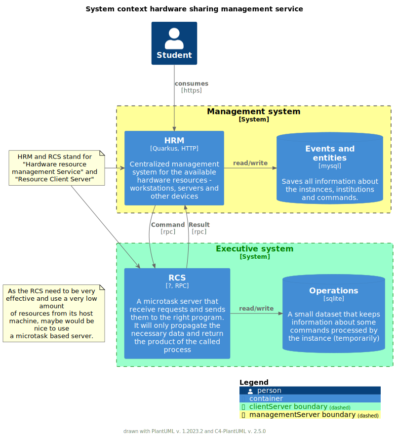
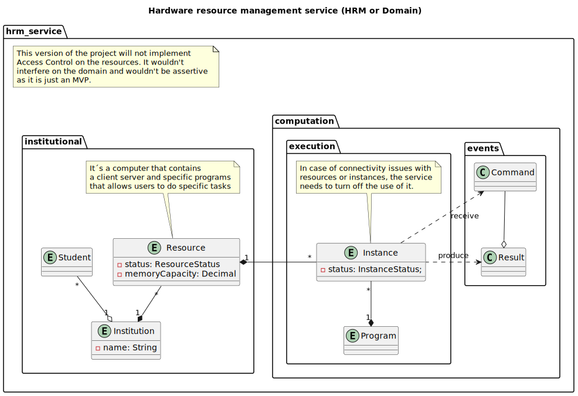

# Hardware resource management

The aim of this application is to address a common problem faced in distance education – the lack of structure for remote studying. To achieve this objective, the application facilitates and simplifies the sharing of idle hardware and program instances between an institution and its students.

Each program instance occupies a certain amount of memory on the hardware (referred to as a "Resource"), and can be used by one student at a time. While a student can use multiple instances, it is essential to maintain a queue of multiple students to keep the instances busy. The system must also keep track of the capacity of each resource to prevent overconsumption.

By enabling the efficient use of hardware resources, the application ensures that students have access to the necessary programs to support their learning. It provides a solution to the problem of inadequate resources for remote education and helps to ensure that students can continue their studies effectively.

Get a look at the main objectives of the application at this [Notion document](https://www.notion.so/Resource-Sharing-Services-044ffd0bc18c4abe9c809a4a4fb006df?pvs=4).




## About the framework

This project uses Quarkus, the Supersonic Subatomic Java Framework.

If you want to learn more about Quarkus, please visit its website: https://quarkus.io/ .

## Running the application in dev mode

You can run your application in dev mode that enables live coding using:
```shell script
./mvnw compile quarkus:dev
```

> **_NOTE:_**  Quarkus now ships with a Dev UI, which is available in dev mode only at http://localhost:8080/q/dev/.

## Packaging and running the application

The application can be packaged using:
```shell script
./mvnw package
```
It produces the `quarkus-run.jar` file in the `target/quarkus-app/` directory.
Be aware that it’s not an _über-jar_ as the dependencies are copied into the `target/quarkus-app/lib/` directory.

The application is now runnable using `java -jar target/quarkus-app/quarkus-run.jar`.

If you want to build an _über-jar_, execute the following command:
```shell script
./mvnw package -Dquarkus.package.type=uber-jar
```

The application, packaged as an _über-jar_, is now runnable using `java -jar target/*-runner.jar`.

## Creating a native executable

You can create a native executable using: 
```shell script
./mvnw package -Pnative
```

Or, if you don't have GraalVM installed, you can run the native executable build in a container using: 
```shell script
./mvnw package -Pnative -Dquarkus.native.container-build=true
```

You can then execute your native executable with: `./target/resource-sharing-services-1.0-SNAPSHOT-runner`

If you want to learn more about building native executables, please consult https://quarkus.io/guides/maven-tooling.

## Provided Code

### RESTEasy Reactive

Easily start your Reactive RESTful Web Services

[Related guide section...](https://quarkus.io/guides/getting-started-reactive#reactive-jax-rs-resources)
