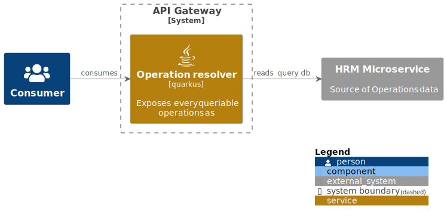

# Resource sharing services 

This application is a re-build of this [DB2 Assignment](https://github.com/githiago-f/resource-sharing).
For contributing, remember you should reexecute the command: `plantuml -tsvg -v -o "out/digramas" "**.puml"`

---

## Objective

The aim of this application is to address a common problem faced in distance education – the lack of structure for remote studying. To achieve this objective, the application facilitates and simplifies the sharing of idle hardware and program instances between an institution and its students.

Each program instance occupies a certain amount of memory on the hardware (referred to as a "Resource"), and can be used by one student at a time. While a student can use multiple instances, it is essential to maintain a queue of multiple students to keep the instances busy. The system must also keep track of the capacity of each resource to prevent overconsumption.

By enabling the efficient use of hardware resources, the application ensures that students have access to the necessary programs to support their learning. It provides a solution to the problem of inadequate resources for remote education and helps to ensure that students can continue their studies effectively.

Get a look at the main objectives of the application at this [Notion document](https://www.notion.so/Resource-Sharing-Services-044ffd0bc18c4abe9c809a4a4fb006df?pvs=4).

---

## Security policy

This application will contain a simplified security policy and will contain all information needed to keep the users safe, and provide a nice and safe environment for the institutions.
